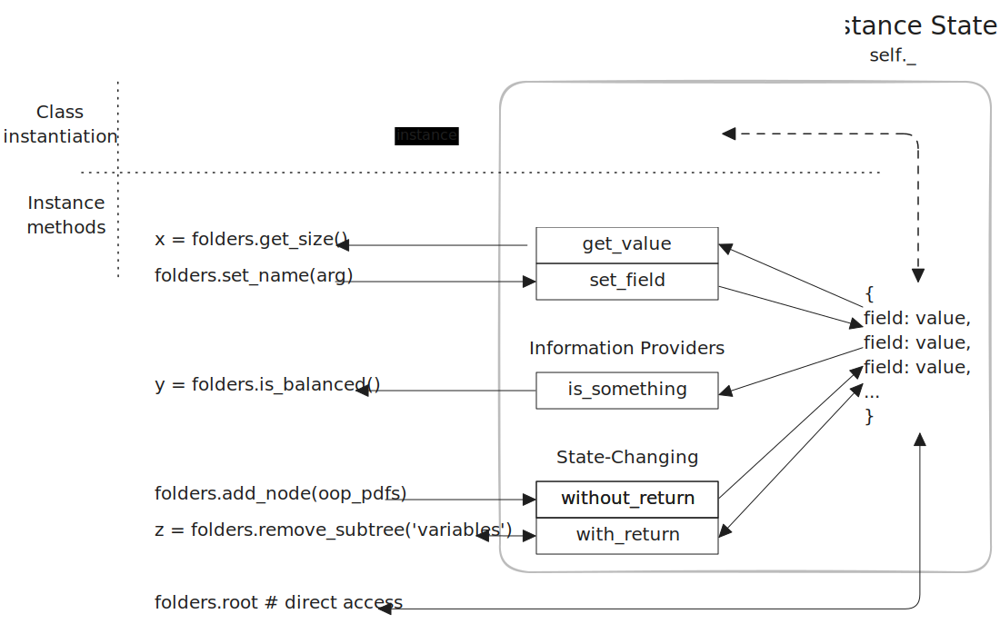

# Analyzing Classes

Explore the connections between a _class declaration_ and how _class instances_ are used in a program with these aspects:

1. **State (Properties)**

   - What data does each instance store in `self.`?
   - What are the types of each property?
   - Are there any obvious constraints on the values?

2. **Construction (Initialization)**

   - Which properties are set during _initialization_ (in `__init__`)?
   - Where do the initial values come from (parameters, defaults, calculations, hard-coded values)?
   - Is there any validation or formatting before values are assigned to `self.`?

3. **Behavior (Methods)**

   - Which methods modify the object's state (using `self.`)? How?
   - Which methods return/print information without changing state?
   - What can users do with this method?
   - Does it: _Create_ new state values? _Read_ state? _Update_ state? _Delete_ state?

4. **State Access**

   - How do developers get information from the object?
   - How do developers modify the object's state directly?
   - Does the class protect its state or require specific methods to access it?

## Visualizing Encapsulation in Action

## Create, Read, Update, Delete

Another way to understand object methods is whether they _create_ new data in the instance, _read_ data from the instance, _update_ data already stored in the instance, or _delete_ data stored in the instance. It's possible for one method to do all four!

