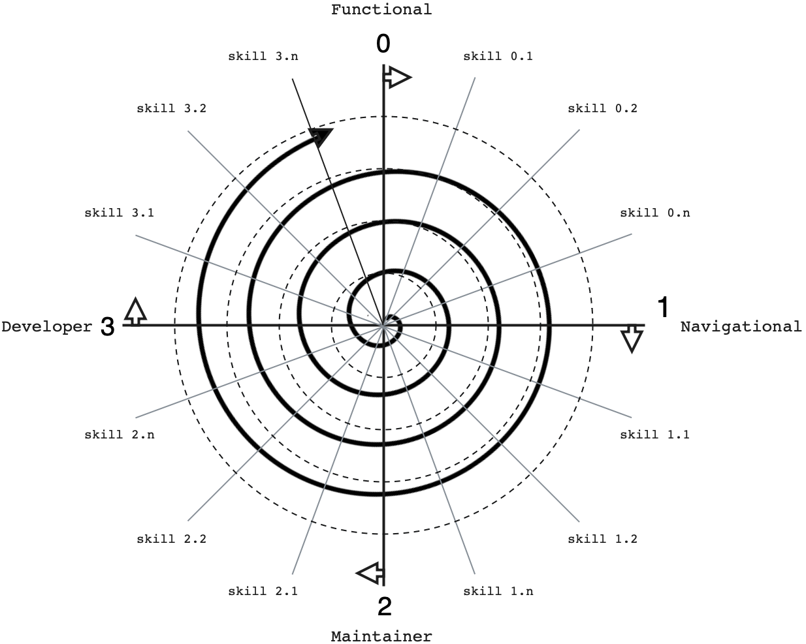

# Programming with OOP

The path laid out in this repository (_predictive stepping_, _analyzing classes_, ...) is a _blueprint_ for studying OOP, this repository is not a one-and-done study resource! We recommend you follow these steps to internalize each new feature/technique you encounter in OOP.

Think of it like a spiral growing out of a bullseye.

- You start at the center mastering development with simple classes; stepping through them, analyzing them, writing them, using them in programs.
- Next you study larger, more complex classes _without_ adding any new language features (eg. inheritance, statics, ...): predicting, analyzing, writing, using.
- After mastering simple classes you level up to (for example) classes inheritance, then repeat the cycle: predict, analyze, write, use.
- Next you master classes with inheritance _and_ static methods: predict, analyze, write, use.
- Then you master ... choose your own adventure!

